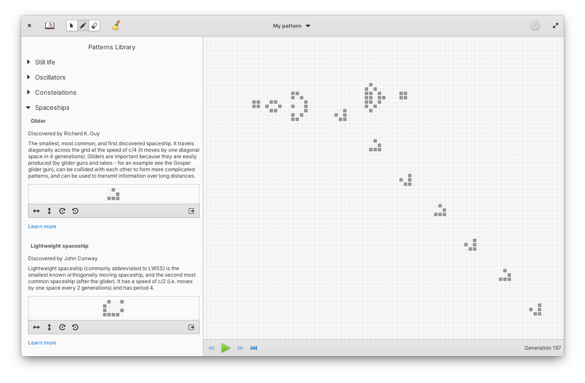

<h1>Life</h1>

[Conway's Game of Life](https://en.wikipedia.org/wiki/Conway%27s_Game_of_Life) made for [elementary OS](https://elementary.io/).

[](COPYING)
[](https://github.com/Antolius/Life/actions)

||          |
|---------------------------------------------------------|-----------------------------------------------------------------|
| A game of life showcasing default (light) style  | A game of life showcasing dark style |

## What's up with that name?

> The Game of Life, also known simply as **Life**, is a [cellular automaton](https://en.wikipedia.org/wiki/Cellular_automaton) devised by the British [mathematician](https://en.wikipedia.org/wiki/Mathematician) [John Horton Conway](https://en.wikipedia.org/wiki/John_Horton_Conway) in 1970. It is a [zero-player game](https://en.wikipedia.org/wiki/Zero-player_game), meaning that its evolution is determined by its initial state, requiring no further input. One interacts with the Game of Life by creating an initial configuration and observing how it evolves.
>
> [Wikipedia, the Free Encyclopedia](https://en.wikipedia.org/wiki/Conway%27s_Game_of_Life)

## Kudos

- First up, major kudos goes to John Conway for coming up with the Game of Life in the first place. Without him none of this would be possible. But also to all the mathematicians, both professional and hobbyist, who have contributed to today's understanding of this wonderful phenomena. Among them, extra kudos goes to contributors and maintainers of the [LifeWiki](https://conwaylife.com/wiki/Main_Page), a wiki dedicated to the Game of Life. Browsing their articles motivated me to create this app, and I used materals from the wiki as a source for the Patterns Library feature.
- There are many approaches to implementing the Game of Life in a computer program. This app uses a genius [Hashlife algorithm](https://en.wikipedia.org/wiki/Hashlife) devised by [Bill Gosper](https://en.wikipedia.org/wiki/Bill_Gosper). In addition to him, kudos goes to [Eric Lippert](https://github.com/ericlippert) for explaining Hashlife, and many other algorithms, in a wonderful series on Game of Life implementations on his [Fabulous adventures in coding](https://ericlippert.com/) blog. Without Eric's approachable and yet highly detailed writing I would not have been able to make this app.
- While on the subject of algorithms, kudos also to Prof. Ketan Shah, Anirban Mitra and [Dhruv Matani](https://github.com/dhruvbird) for their [constant time algorithm for least frequently used cache](http://dhruvbird.com/lfu.pdf). Hashlife heavily depends on caching, and this cache implementation is efficient and elegant. Kudos also goes to [Arpit Bhayani](https://github.com/arpitbbhayani) for explaining the algorithm in a beautifully crafted [blog post](https://arpitbhayani.me/blogs/lfu).
- Last but not least, kudos goes to the [elementary team](https://elementary.io/team) for building and maintaining such a solid platform and a welcoming environment for app developers, with special thanks to [Danielle Foré](https://github.com/danrabbit) or running the show.

## Status

Life is currently in pre-release stage of development. This means that while things are shaping up there are still bugs, app crashes, and missing features. Here's a rough list of features which work already and those that I'd like to add / polish before the initial release:

- [x] App can run a Game of Life simulation at various speeds with automatically expanding simulation boundaries.
- [x] User can draw and erase live cells to create patterns in the simulation.
- [x] User can edit cells by copying / pasting, rotating and flipping a selection.
- [x] User can explore an included Patterns Library to discover building blocks of larger Game of Life patterns.
- [x] User can save / open cell patterns into / from files.
- [x] App remembers and restores current pattern of cells between restarts.
- [x] Operations of running the simulation, writing to files and interacting with the UI don't block each other.
- [ ] User without previous knowledge of Game of Life can learn basics from a built-in tutorial.

I'm also considering adding some features after the initial release:

- [ ] Support for [multiple file formats](https://conwaylife.com/wiki/File_formats).
- [ ] Option to export evolving simulation in a video or a gif image.
- [ ] Helper tools for crafting patterns, for example rulers or advanced cell highlights.
- [ ] More advanced filter and search over the Patterns Library.
- [ ] Adding more patterns into the Patterns Library.

The app will be released in the [elementary OS AppCenter](https://appcenter.elementary.io/) as a flatpak. However, for now the only way to install it is by building it from the source code.

## How to build from source

If you want to you can build Life locally, from source. You can find detailed instructions for setting up local environment in [elementary developer docs](https://docs.elementary.io/develop/writing-apps/the-basic-setup).

Life app is based on the elementary OS 7 platform. Currently this version of the OS is in [early access](https://builds.elementary.io/), although a release is expected soon. You can build the app with meson from an OS 7. Alternatively, you can build it from any other operating system with flatpak.

### Build it with flatpak

You may need to install elementary flatpak runtime first. You can do that with:

```sh
flatpak install --user io.elementary.Sdk//7
```

To install Life use `flatpak-builder`, from project root directory run:

```sh
flatpak-builder build hr.from.josipantolis.life.yml --user --install --force-clean
```

then run it with with:

```sh
flatpak run hr.from.josipantolis.life
```

### Build it with meson

> ⚠️ Warning ⚠️
>
> This does require elementary OS 7, which is currently in [early access](https://builds.elementary.io/).

You can meet all dependencies by installing [elementary SDK](https://docs.elementary.io/develop/writing-apps/the-basic-setup#development-libraries) and [GSL](https://www.gnu.org/software/gsl/):

```sh
sudo apt install elementary-sdk libgsl-dev
```

For a full list of dependencies check out the [meson.build file](meson.build).

Run `meson build` to configure build environment. Change into the build directory and run `ninja` to build

```sh
meson build --prefix=/usr
cd build
ninja
```

To install, use `ninja install`, then execute with `hr.from.josipantolis.life`

```sh
ninja install
hr.from.josipantolis.life
```

### Translate it?!

To generate translation files execute

```sh
ninja hr.from.josipantolis.life-pot
ninja extra-pot
ninja hr.from.josipantolis.life-update-po
ninja extra-update-po
```

## License

[GNU GPLv3](COPYING)

Copyright © 2022 Josip Antoliš, josip.antolis@protonmail.com.
