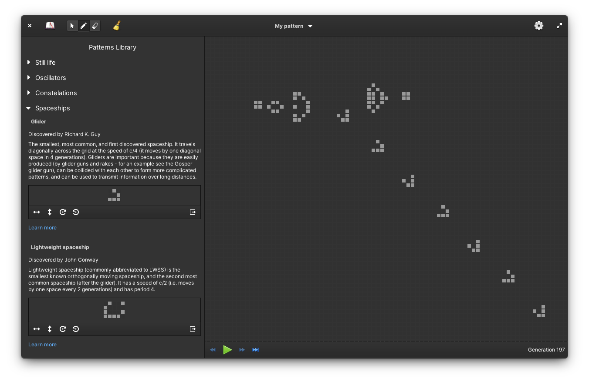

<h1>Life</h1>

[Conway's Game of Life](https://en.wikipedia.org/wiki/Conway%27s_Game_of_Life) made for [elementary OS](https://elementary.io/).

||          |
|---------------------------------------------------------|-----------------------------------------------------------------|
| A game of life showcasing default (light) style  | A game of life showcasing dark style |


## How to build from source

If you want to you can build Life locally, from source. You can find detailed instructions for setting up local environment in [elementary developer docs](https://docs.elementary.io/develop/writing-apps/the-basic-setup).

### Build it with meson

You can meet all dependencies by installing elementary SDK:

```sh
sudo apt install elementary-sdk
```

For a full list of dependencies check out the [meson.build file](meson.build).

Run `meson build` to configure build environment. Change into the build directory and run `ninja` to build

```sh
meson build --prefix=/usr
cd build
ninja
```

To install, use `ninja install`, then execute with `hr.from.josipantolis.life`

```sh
ninja install
hr.from.josipantolis.life
```

### Build it with flatpak

You may need to install elementary flatpak runtime first. You can do that with:

```sh
flatpak install --user io.elementary.Sdk//6.1
```

To install Life use `flatpak-builder`, from project root directory run:

```sh
flatpak-builder build hr.from.josipantolis.life.yml --user --install --force-clean
```

then execute with:

```sh
flatpak run hr.from.josipantolis.life
```

### Translate it?!

To generate translation files execute

```sh
ninja hr.from.josipantolis.life-pot
ninja extra-pot
ninja hr.from.josipantolis.life-update-po
ninja extra-update-po
```

## License

[GNU GPLv3](COPYING)

Copyright © 2022 Josip Antoliš, josip.antolis@protonmail.com.
